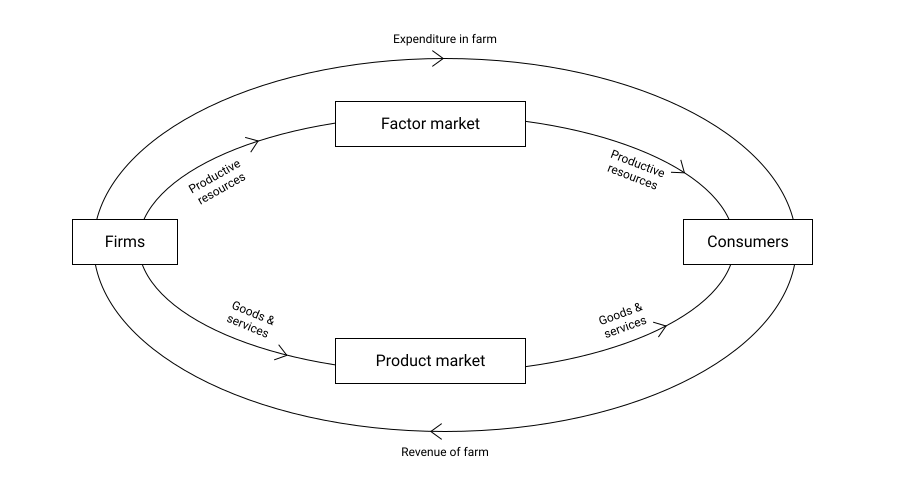

# Introduction to economics

#### Why should an engineering student study economics ?
An engineer may wish to study economics because an understanding of economics will allow the engineer to make better, more well-informed choices in his/her everyday life, wether the choice is about spending various savings or having decided on how to allocate savings between different assets.

1. Fundamentally engineers are builders, designers, and creators, most of whatever they design are to be sold to the public the goods and services are governed by the market (Economy) Therefore sound understanding of how the economy works is crucial for success in engineering life.
2. As an engineer climbs the corporate ladder, there will be greater exposure to managing money and resources. Economics is all about the wise allocation and savings between different assets.
3. Engineering economy provides nigher order thinking similar to engineer discipline (Analyze , Evaluate, create)


#### Opportunity cost
The best alternative that we have forgone when we make a choice.


#### 4 factors of production:
1. Land - Natural resources
2. Laber - Physical
3. Capital
4. Entrepreneurship





#### Explain PPF in concave downward.
Production Possilbilty Frontiere (PPF) The possible combination of two goods that an economy can produce in  a certain period of time under the given state of technology.

increasing oppertunity cost, As more of one good is produced the opportunity cost of that good increases.


> Recommended book : **Economics** by Roger A Arnold


```yaml
title: Introduction to economics
date: 2022-08-03
faculty: Md. Saddam Hossain
prepared_by: Hazzaz, Shohan
contributor: Hazzaz, Shohan
```
